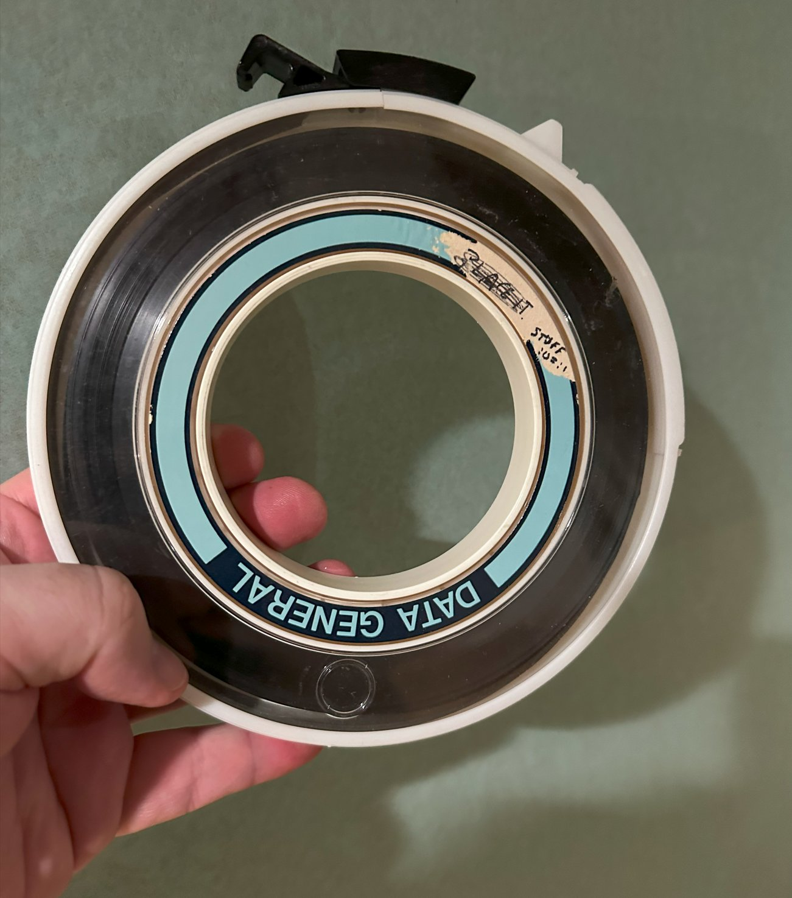

# old-internet

A collection of files from my 1991 VAX/VMS ULowell user account, which also includes a selection of files downloaded from the Internet at the time, back when it was almost entirely government and educational institutions.

**Please note:** these files are a snapshot from 1991 when I was 19. They do not necessarily represent the views, opinions, beliefs (or spelling) of today. There are things in here which I would not share today, some things that are in poor taste, and some which contain views represented which I do not currently hold. There are files with very offensive terms in them, specifically some of the jokes in the public folder.

However, other than the few files which contained personal information (addresses, for example), I have not redacted anything. I recognize this could upset some folks, so please approach this as you would any other product of a specific time and place.

I recognize this repo is hugely exposing, but I think the value of a snapshot like this is worth it. It's rare to find this kind of a time capsule out there.

## File types

The files are from a VAX/VMS cluster from the early 90s. Some of the file types are meaningful to VMS, others are just how I named things. The public folder contains contributions from the internet, friends, and more.

| File | What |
| ---------------- | -------------- |
| .COM | A VMS Command script. Think of it like a batch file or shell script |
| .jok | Joke file. Warning: it was 1990/1991. |
| .sho | Usually involved some VT Terminal animated ASCII art |
| .pas | Pascal source files (computer science students started with Pascal) |
| .pyt | Monty Python episode or movie script |
| .poem | Extra cringe-worth poems from 18/19yo me. Don't judge. |

In addition to the actual CS assignments, there were also several side projects I had going on in college

* The public folder for people to contribute things to
* A personals system friends posted to. I didn't remember this until seeing the files
* A few games I was working on, but never finished. Some are from scratch, others are adaptations of existing source. Time Riffte, Nemesis, etc.
* Some really stupid and somewhat offensive random sentence generators
* Things that I used to put obnoxious phrases into the VMS process list
* This whole weird secondary login thing I created for my account. I don't recall if I was just paranoid or had a real reason for it.
* Programs to annoy the hell out of someone by spamming them before spamming mail was a thing.
* Programs to really ruin someone's day by using the VMS phone program to blast escape codes at their screen for beeps and much more. Pretty sure these were adaptations of existing similar programs.
* Some very suspect things I did to trick people and get access to other accounts at university.

## Some call-outs

Here are some of the files I think are worth looking at, and which contain, at most, only marginally offensive things.

| File | What |
| ---------------- | -------------- |
| public/smiles.txt | The unofficial smilie dictionary (for those used to emojis) |
| public/mudlisting.txt public/mudlist.txt | list of MUDs (Multi-User Dungeons -- multi-player text adventures) |
| public/grail.pyt | Yes, of course I had the entire script of Monty Python and the Holy Grail in there |

## The tape

This is the original tape



Here is the source I compiled to be able to read it. Compiled and ran on WSL on Windows 11.

[VMSBackup source](https://github.com/kkaempf/vmsbackup)

And I'll finish with my .sig from back then, as one should. Nemesis was a MUD I was developing at the time.

```
.---------.---------------------------------------------------------------.
|   /|\   |             Peter M Brown, The Psychlist                      |
|  /\|/\  | snappa@wombat.gnu.ai.mit.edu      pbrown@cs.ulowell.edu       |
| /\/|\/\ | brownp@woods.ulowell.edu          gmngr4@woods.ulowell.edu    |
| Nemesis | "we're all one and Life flows on within you and without you." |
`---------'---------------------------------------------------------------'
```
